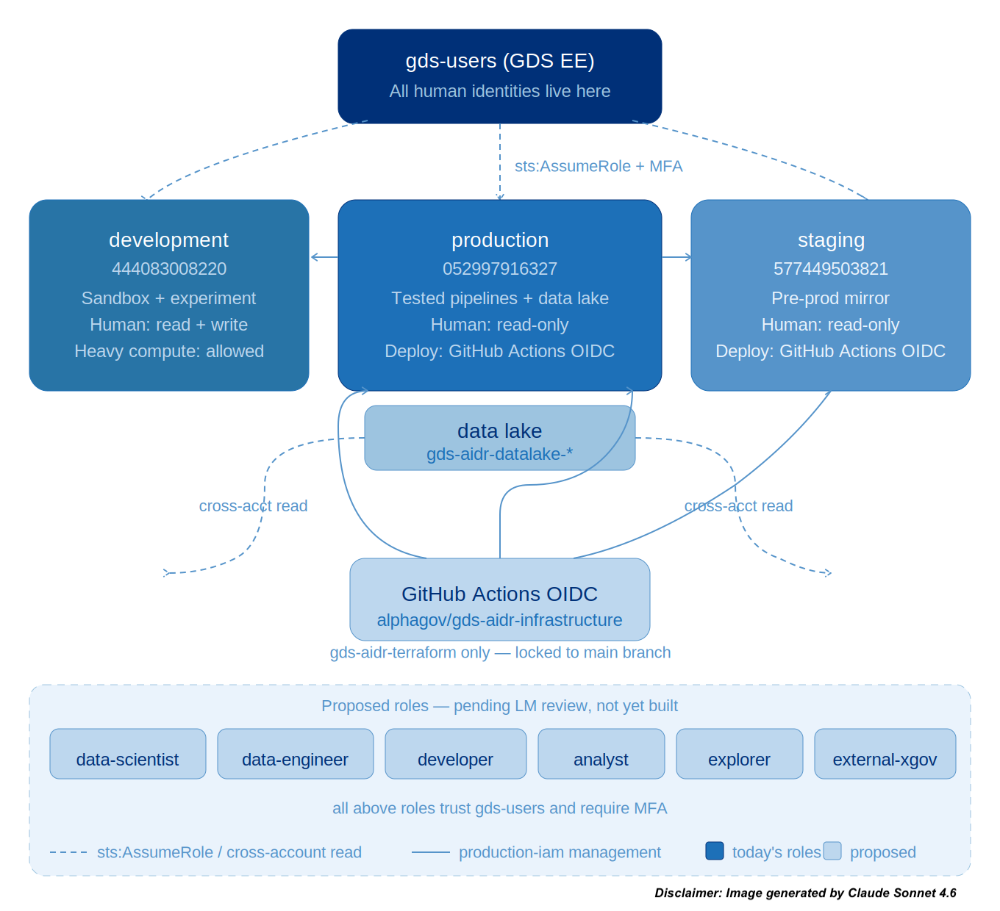

# IAM Cross-Account Strategy (Centralised)

<!--date_added:thurs-28-may-2026-->
<!--date_updated:fri-29-may-2026-->

**date_updated:** fri-29-may-2026

**Description:** Our account strategy is built in conjunction with GDS Engineering Enablement Cloud Platform Team and Secure by Design processes.

> **See also:** `docs/infrastructure/iam-access-strategy.md` — the full access policy document covering role taxonomy, people-to-role mapping, environment access rules, external access, data architecture, auditing and the implementation roadmap. This document covers the cross-account technical mechanism; that document covers the access design.

---

## Overview



All IAM roles and GitHub OIDC providers across all three AWS accounts (development, staging, production) are managed from a single Terraform environment: `production-iam`.

This runs in the production account and uses provider aliases to assume into development and staging to create resources there.

**Why centralised**

- **Single source of truth**: one state file contains every role across every account. No drift between environments.
- **Single PR**: a change to any role goes through one pull request with one review.
- **Auditability**: `terraform state list` shows every role in the organisation.

**Current layout (deployed)**
```
gds-users (org root, 622626885786)
├── gds-aidr-development (444083008220)
│   ├── gds-aidr-admin          ← admins only (named ARNs + MFA)
│   ├── gds-aidr-readonly
│   ├── gds-aidr-security-audit
│   ├── gds-aidr-terraform      ← human + GitHub OIDC
│   └── GitHub OIDC provider
├── gds-aidr-staging (577449503821)
│   ├── gds-aidr-readonly
│   ├── gds-aidr-security-audit
│   ├── gds-aidr-terraform      ← human + GitHub OIDC
│   └── GitHub OIDC provider
└── gds-aidr-production (052997916327)
    ├── gds-aidr-admin          ← admins only (named ARNs + MFA)
    ├── gds-aidr-readonly
    ├── gds-aidr-security-audit
    ├── gds-aidr-terraform      ← human + GitHub OIDC
    └── GitHub OIDC provider
```

**Proposed layout (pending LM review — see `iam-access-strategy.md`)**
```
gds-users (org root, 622626885786)
├── gds-aidr-development (444083008220)
│   ├── gds-aidr-admin               ← admins only (named ARNs + MFA)
│   ├── gds-aidr-admin-break-glass   ← emergency writes, 1hr session, SNS alert
│   ├── gds-aidr-terraform           ← human + GitHub OIDC
│   ├── gds-aidr-data-scientist      ← full dev access excl. IAM writes
│   ├── gds-aidr-data-engineer       ← same as data-scientist + CI/CD trigger
│   ├── gds-aidr-developer           ← broad dev access excl. IAM writes
│   ├── gds-aidr-analyst             ← Athena, S3 scoped, Glue catalog, QuickSight
│   ├── gds-aidr-explorer            ← console read-only
│   ├── gds-aidr-external-xgov       ← resource-scoped, S3 prefix + Athena workgroup
│   ├── gds-aidr-readonly            ← retained
│   ├── gds-aidr-security-audit
│   └── GitHub OIDC provider
├── gds-aidr-staging (577449503821)
│   ├── gds-aidr-admin               ← read-only by default; writes via break-glass only
│   ├── gds-aidr-admin-break-glass
│   ├── gds-aidr-terraform
│   ├── gds-aidr-data-scientist      ← read-only
│   ├── gds-aidr-data-engineer       ← read + CI/CD trigger
│   ├── gds-aidr-developer           ← read + deploy via OIDC
│   ├── gds-aidr-analyst             ← read-only
│   ├── gds-aidr-explorer            ← read-only
│   ├── gds-aidr-readonly
│   ├── gds-aidr-security-audit
│   └── GitHub OIDC provider
└── gds-aidr-production (052997916327)
    ├── gds-aidr-admin               ← read-only by default; writes via break-glass only
    ├── gds-aidr-admin-break-glass
    ├── gds-aidr-terraform
    ├── gds-aidr-data-scientist      ← read-only + cross-account data lake read
    ├── gds-aidr-data-engineer       ← read + CI/CD trigger
    ├── gds-aidr-developer           ← read + deploy via OIDC
    ├── gds-aidr-analyst             ← read-only
    ├── gds-aidr-explorer            ← read-only
    ├── gds-aidr-readonly
    ├── gds-aidr-security-audit
    └── GitHub OIDC provider
```

## How the cross-account assumption works

### The trust chain

Every action on the AIDR platform traces back to the `gds-users` identity.
Here is how the chain works when you run Terraform locally:

```
User (gds-users account, 622626885786)
  │
  │  1. You run `aws sts assume-role` with your MFA code.
  │     AWS checks: does gds-aidr-admin in production trust gds-users? Yes.
  │     Result: you get temporary credentials for production.
  │
  ├─► production: gds-aidr-admin (052997916327)
  │     │
  │     │  2. Terraform starts. It reads provider aliases in main.tf.
  │     │     The development alias says: assume gds-aidr-terraform in dev.
  │     │     AWS checks: does gds-aidr-terraform in dev trust gds-users? Yes.
  │     │     (Your session still carries the gds-users origin.)
  │     │     Result: Terraform can create/modify resources in dev.
  │     │
  │     ├─► development: gds-aidr-terraform (444083008220)
  │     │
  │     │  3. Same for staging.
  │     │
  │     ├─► staging: gds-aidr-terraform (577449503821)
  │     │
  │     │  4. Production resources use the default provider (no alias).
  │     │     No second hop needed — Terraform is already in production.
  │     │
  │     └─► production resources (direct, no assume needed)
  │
  │  For manual debugging (not Terraform):
  │
  ├─► development: gds-aidr-readonly (444083008220)
  │     View resources, check CloudWatch, verify deployments.
  │
  └─► staging: gds-aidr-readonly (577449503821)
        Same as above.
```

### Role scopes

**Deployed roles**

**admin**: Full `AdministratorAccess`. In development and production only.
Trust restricted to specific named IAM user ARNs (not the broad account root).
MFA always required.

**readonly**: AWS-managed `ReadOnlyAccess`. For viewing resources, debugging,
verifying CloudWatch logs. MFA required.

**security-audit**: AWS-managed `SecurityAudit`. Used by the GDS Cyber
Security team and automated scanning tools. Follows
`alphagov/cyber-security-shared-terraform-modules` pattern.

**terraform**: Full `AdministratorAccess`. Trusts both gds-users (human, MFA)
and GitHub Actions (OIDC). The OIDC subject is locked to
`repo:alphagov/gds-aidr-infrastructure:ref:refs/heads/main` so only merged
PRs can trigger applies.

**Proposed roles (pending LM review)**

**admin-break-glass**: Full `AdministratorAccess` in staging and production.
Separate from `admin` — exists only for emergency writes to IaC-governed
environments. 1-hour session duration. Emits a CloudWatch alarm and SNS
notification to both admins on every assumption. Requires a logged justification
before use.

**data-scientist**: Full dev access except IAM writes. Heavy compute (Glue,
SageMaker, Bedrock, EMR, Redshift) available in development only. Read-only
in staging and production. Cross-account read on production data lake buckets.

**data-engineer**: Same as data-scientist in development, plus write access to
`gds-aidr-datalake-experimental/` prefix. Read plus CI/CD trigger permissions
in staging and production (CodePipeline invoke, CodeBuild log view).

**developer**: Broad permissions in development, no IAM writes. Scope refined
over time. Read-only via console in staging and production; deployments via
OIDC only. Heavy compute blocked.

**analyst**: Scoped to Athena, S3 (specific buckets), Glue Data Catalog read,
QuickSight in development. Read-only in staging and production. Heavy compute
blocked.

**explorer**: Console read-only across all three environments. For non-technical
users who need visibility but no ability to change anything. Replaces ad-hoc use
of `readonly` for team members without engineering roles.

**external-xgov**: Resource-scoped role in development only. Trusts the account
root ARNs of specific cross-government departments (Cabinet Office, National
Archives initially). Access restricted to named S3 prefixes
(`gds-aidr-external-xgov-{dataset-name}`) and a dedicated Athena workgroup.
Session tag `Access=xgov` enforced. Never staging or production.

### How to assume a role (CLI)

```bash
# ~/.aws/config
[profile gds-aidr-admin-production] # ADMINS ONLY
role_arn = arn:aws:iam::052997916327:role/gds-aidr-admin
source_profile = gds-users
mfa_serial = arn:aws:iam::622626885786:mfa/<your-username>
duration_seconds = 14400
region = eu-west-2

[profile gds-aidr-readonly-development]
role_arn = arn:aws:iam::444083008220:role/gds-aidr-readonly
source_profile = gds-users
mfa_serial = arn:aws:iam::622626885786:mfa/<your-username>
duration_seconds = 14400
region = eu-west-2
```

```bash
# Verify it works
aws sts get-caller-identity --profile gds-aidr-admin-production
```

**How to apply**

```bash
cd infrastructure/terraform/environments/production-iam
cp terraform.tfvars.example terraform.tfvars
# Edit terraform.tfvars with your actual values

eval $(aws sts assume-role \
  --role-arn "arn:aws:iam::052997916327:role/gds-aidr-admin" \
  --role-session-name "TerraformSession" \
  --serial-number "arn:aws:iam::622626885786:mfa/<your-username>" \
  --token-code <YOUR_MFA_CODE> \
  --profile gds-users \
  --query 'Credentials.[AccessKeyId,SecretAccessKey,SessionToken]' \
  --output text | awk '{print "export AWS_ACCESS_KEY_ID="$1"\nexport AWS_SECRET_ACCESS_KEY="$2"\nexport AWS_SESSION_TOKEN="$3}')

unset AWS_PROFILE
aws sts get-caller-identity   # verify you are in the correct account

terraform init
terraform plan
terraform apply
```

### Security considerations

1. **MFA is mandatory** for all human role assumptions.
2. **No long-lived credentials** — CI/CD uses OIDC tokens only.
3. **No admin in staging** — changes go through Terraform only.
4. **Admin trust is name-scoped** — specific user ARNs, not account root.
5. **OIDC subjects are branch-locked** — only `main` can trigger applies.
6. **4-hour session max** — limits the window if credentials are compromised.
7. **No IAM users in member accounts** — all access via role assumption from
   `gds-users`. No exceptions. External users are trusted via their own account
   roots, not local credentials.
8. **Write-deny on staging and production** (proposed) — human-assumed roles
   cannot write to staging or production. Emergency writes use the break-glass
   role with mandatory logging and SNS notification.
9. **Heavy compute gated** (proposed) — Glue, SageMaker, Bedrock, EMR, Redshift
   blocked for most roles in all environments; available to data-scientist and
   data-engineer in development only.
10. **Session tagging enforced** (proposed) — every assumption requires tags
    `User`, `Team`, `Purpose`. Tags propagate into CloudTrail and Cost Explorer.
11. **Trust policies are parameterised** — all trusted ARNs are Terraform
    variables, never hardcoded. Adapting to GDS EE federation changes is a
    one-line edit in `terraform.tfvars`.

**Terraform state**

Each environment stores state in its own S3 bucket with S3-native locking:

| Environment | S3 Bucket |
|---|---|
| development | `gds-aidr-terraform-state-development` |
| staging | `gds-aidr-terraform-state-staging` |
| production | `gds-aidr-terraform-state-production` |

State locking uses the `use_lockfile = true` setting (S3-native locking),
which replaced the older DynamoDB-based approach.

## Data lake (cross-account access)

The production data lake (`gds-aidr-datalake-*` buckets) is accessible
read-only from development and staging via cross-account bucket policies.

This gives all three environments access to the same data without
mirroring storage. Development and staging roles have `s3:GetObject` and
`s3:ListBucket` on production data lake buckets, granted at both the role
level (IAM policy) and the bucket level (S3 bucket policy). Both grants are
required — AWS enforces the cross-account intersection.

The `gds-aidr-datalake-experimental/` prefix in production is additionally
writable by the `data-engineer` role in development, for pipeline testing.

A dedicated fourth account (`gds-aidr-data`) may be created in future if the
data lake exceeds a cost threshold or if other teams need access. Bucket names
are Terraform-variable-referenced so migration requires no application code
changes.

### Bootstrap (completed)

The bootstrap process has been completed and the bootstrap roles have been
deleted. This section is kept for historical reference.

Before running the centralised Terraform for the first time, temporary
`gds-aidr-terraform-bootstrap` roles were created in development and staging.
These had `IAMFullAccess` only and trusted the production account root, so
that the first `terraform apply` could create the proper IAM roles.

After the first successful apply, the provider aliases in `main.tf` were
updated to use `gds-aidr-terraform` instead of `gds-aidr-terraform-bootstrap`,
and the bootstrap roles were deleted.

## FAQs

* **Why gds-aidr-admin, not bootstrap?**

The `bootstrap` role was a temporary role created before any Terraform-managed
roles existed. It only had `IAMFullAccess` (not full admin) and its sole
purpose was to allow the first `terraform apply` to create the proper roles.

Once the proper roles exist, the bootstrap roles are deleted. The
`gds-aidr-admin` role is the permanent replacement — it has full
`AdministratorAccess` but is restricted to named IAM admin users only, with MFA required.

* **Why the trust works across accounts**

The `gds-aidr-terraform` roles in development and staging have a trust policy
that says: "allow anyone from the gds-users account root to assume this role,
with MFA". When you assume `gds-aidr-admin` in production, your session token
still records that you originally authenticated from `gds-users`. So when
Terraform (running as your production session) tries to assume
`gds-aidr-terraform` in development, AWS sees the gds-users origin and
allows it.

If someone tried to assume `gds-aidr-terraform` in dev directly from a
production-only role (one that doesn't trace back to gds-users), it would
be denied. This is what happened with the old `bootstrap` role — it was
a production-local role with no gds-users lineage.

* **Why no IAM users in member accounts?**

Cross-government infrastructure guidance is clear: no IAM users in member
accounts. Long-lived credentials require rotation, duplicate identity
management, and create an audit gap. All access uses role assumption from
`gds-users`. For external users who are not on `gds-users`, access is granted
via their own AWS account root (cross-government) or deferred to GDS EE
(non-government). See `iam-access-strategy.md` section 10 for full detail.

* **Why is admin read-only in staging and production?**

Staging and production are IaC-driven environments — their state is governed
by Terraform applied through GitHub Actions. Allowing human writes (even by
admins) risks state drift: the console reflects something different from what
Terraform declared. The break-glass role provides emergency write access
when genuinely needed, with mandatory logging and notification.

### References

- `docs/infrastructure/iam-access-strategy.md` — full access policy (primary reference)
- [alphagov/cyber-security-shared-terraform-modules](https://github.com/alphagov/cyber-security-shared-terraform-modules)
- [alphagov/govuk-infrastructure](https://github.com/alphagov/govuk-infrastructure)
- [alphagov/github-oidc-proxy](https://github.com/alphagov/github-oidc-proxy)
- [GDS Way: AWS account management](https://gds-way.cloudapps.digital/)